Professor: Otavio Reis
Plaforma: Digital Innovation One
Bootcamp santander fullstack

[comment]: <> (link de como utilizar markdown : https://docs.pipz.com/central-de-ajuda/learning-center/guia-basico-de-markdown#open)

# Introdução ao git

## **Entenda o que é git e sua importância**

### **Git**

Git é um sistema de controle de versão open-source, ou seja, gratuito. Ele é utilizado para a criação de um histórico de alterações em código-fonte de projetos de desenvolvimento de software. Foi desenvolvido por Linus Torvalds, o criador do sistema operacional Linux.

Por meio de sua utilização, podemos saber quais foram as alterações realizadas, quem fez cada uma das alterações e baixar essas mudanças em nossa máquina. Se necessário, revertê-las para uma versão anterior.
>>Fonte : [blog.betrybe.com/tecnologia/git-e-github](https://blog.betrybe.com/tecnologia/git-e-github/) 


Ele é um sistema de controle de versões distribuído, usado principalmente no desenvolvimento de software, mas pode ser usado para registrar o histórico de edições de qualquer tipo de arquivo (Exemplo: alguns livros digitais são disponibilizados no GitHub e escrito aos poucos publicamente). O Git foi inicialmente projetado e desenvolvido por Linus Torvalds para o desenvolvimento do kernel Linux, mas foi adotado por muitos outros projetos.

Cada diretório de trabalho do Git é um repositório com um histórico completo e habilidade total de acompanhamento das revisões, não dependente de acesso a uma rede ou a um servidor central. O Git também facilita a reprodutibilidade científica em uma ampla gama de disciplinas, da ecologia à bioinformática, arqueologia à zoologia.
>> Fonte : [wikipedia.org/wiki/Git](https://pt.wikipedia.org/wiki/Git)

### **Github**

O Github é um repositório remoto, criado como um serviço online de hospedagem de repositórios do Git.
>> Fonte : https://blog.betrybe.com/tecnologia/git-e-github/


Funciona como um servidor que agrega todas as modificações realizadas por cada uma das pessoas envolvidas em um projeto, unificando as diferentes versões de código e seus históricos, permitindo compartilhamento entre as equipes.

Além disso, o GitHub também conta com várias integrações com outros serviços online, permitindo o deploy automático de aplicação. Assim, garante a integração contínua e facilita o desenvolvimento.

### **Vantagens da utilização dessas tecnologias**

1. Controle de versão(Foco principal do curso)
2. Armazenamento em nuvem
3. Trabalho em equipe
4. Melhorar seu código
5. Reconhecimento(Funciona como uma rede social, se você cria um projeto que tenha uma relevância, você acaba ganhando reconhecimento)


# **Navagação via command lin einterface e instalação**

## **Comandos básicos para um bom desenvolvimento no terminal**

Comando básicos para utilizar o git no terminal e como instalar o git.

### **GUI X CLI**

- GUI: Graphic User Interface. É composta por todos os recursos gráficos utilizados pelo usuário para que o mesmo consiga exercer suas tarefas facilmente, sem a necessidade de conhecimento profundo de comandos. O cursor e os ícones são alguns dos elementos da `GUI`.
- CLI: Command Line Interface. É a parte "complicada" de um sistema operacional. Seja qual for ele, a `CLI` está presente e seu uso é destinado aos experts que necessitem fazer ações não disponíveis via GUI. Não sendo nada intuitiva, necessita de alto conhecimento de comandos. O terminal Linux e o CMD do Windows são exemplos de emuladores de `CLI`.
>> Fonte : https://sites.google.com/site/mendeshtml/-curiosidades/interface

### **O que vamos aprender**
- Mudar de pastas
- Listar pastas
- Criar pastas/arquivos
- Deletar pastas/arquivos
- 
Sistemas Operacionais

Windows | Unix
:-----: | :-----:
`cd`         | `cd`
`dir`        | `ls`
`mkdir`      | `mkdir`
`del/rmdir`  | `rm - rf`

O terminal do windows é derivado do `shell` e do linux é derivado do `bash`. Por isso temos comando diferentes para esses sistemas.

Comandos: 

* shell: `dir`, lista os arquivos presentes no ditetório onde nos encontramos.
* bash: `ls`
* bash: `ls -a`, mostra arquivos ocultos

* shell e bash: `cd** /`, comando usado para voltar na base do diretório


* shell e bash: `cd <nome pasta>`, para poder navegar para um próximo diretório


* shell e bash: `cd ..`, retrocede uma pasta


* shell: `cls`, limpa o terminal
* bash: `clear` ou `crtl + l`(atalho no bash)


* shell e bash: tecla `<tab>`, alto completa 


* shell e bash: `mkdir <nome da pasta>`, cria uma pasta, obs usar o comando sudo su para obter prmissão


* shell e bash: `echo <string>`, comando para exibir uma mensagem que eu queira no terminal. 
* shell e bash: `>`, faz um redirecionamento de fluxo
* shell e bash: `echo hello > hello.txt`, vai criar o arquivo e direcionar a escrita para ele.


* shell: `del <pasta>`, deleta tudo que tem dentro da pasta selecionada


* shell: `rmdir <nome da pasta> /S /Q`, para removar o repositório, foi utilizado flags.
* bash: `rm -rf<nome da pasta>`, o `r` quer dizer recursivo, ou seja, remove até chegar a 0 pastas, o `f` faz referência a force, ou seja, elimita a possibilidade de perdir permissão para realizar tal tarefa.


* bash: `mv <nome arquivo> <direotrio de destino apartir do atual>`, move arquivos : mv receita ./receitas 


## **Ressaltando as principais diferenças entre os sistemas operacionais**

### **Instalando o git**

Link para baixar o git: [link git](https://git-scm.com/downloads)

* shell e bash: `git --version`, verifica a versão do git instalada.


# **Entendendo como o Git funciona por baixo dos panos**

## **Tópicos fundamentais para entender o funcionamento do Git**

* SHA1
* Objetos fundamentais
* sistema distribuido
* segurança 


## **Objetivos internos do Git**

* SHA1

 A sigla SHA signifiva Secure Hash Algorithm, é um conjunto de funçõe hash criptográficas projetadas pela NSA.

A encriptação grra conjuntos de characteres identificador de 40 dígitos.

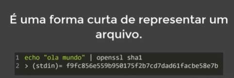

```
No git bash
open sha1 texto.txt

Observação, será gerado os caracteres da criptográfia. Essa é uma forma de protejer e diferenciar versões de um mesmo arquivo.
```

* Objetos fundamentais

* **blobs trees commits**
Esses são os objetos fundamentais do git.

  * Blobs

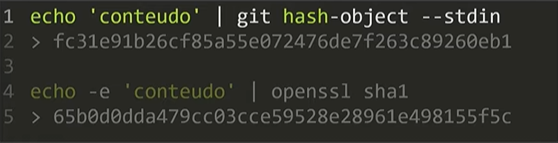

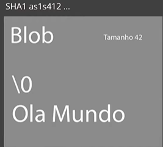

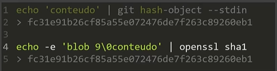

>>Blobs, contém metadados do arquivo e o conteúdo que o mesmo armazarna.

  * Trees
 
Objeto árvore, responsável por montar toda a estrutura do aruivo. Ponte apontar para blobs ou mesmo para outras arvores. Essa arvore também armazena metadados.

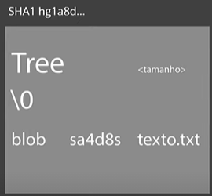

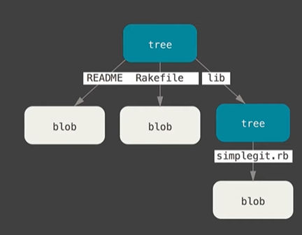

  * Commit

Objeto commit, é a parte que interliga tudo.

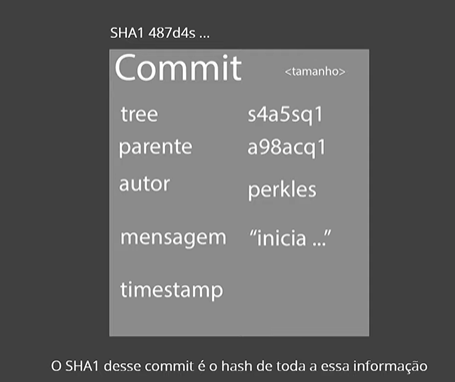

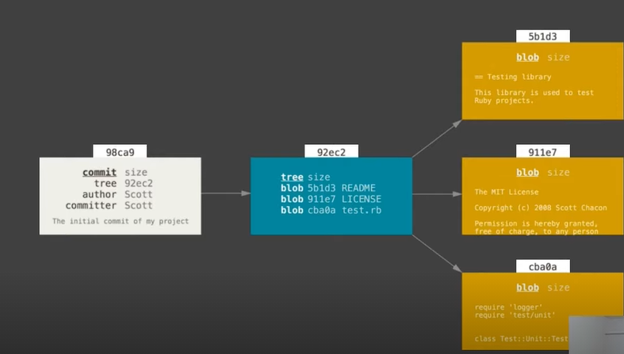

* sistema distribuido

É um sistema distribuido pois, temos um servidor com a base do arquivo e além disso temos o mesmo arquivos em sertvidores locais.

# **Primeiros comandos com o Git**

### **Iniciando o Git e criando um commit** 

Primeiros comandos com o git

* Iniciat o Giat
  * `git init`
* Iniciar o versionamento
  * `git add` 
* Criar um commit
  * `git commit

Criando um repositório

* Comandos
  * git init, inicializa o git
  * git config --global user.email "<email>"
  * git config -- global user.name <nome>
  * git branch -m master main
  * git add .
  * git commit -m "<mensagem>"
  * git status, mostra o estado que se encontra o repositório
  * git config --list, lista todas as configurações do git
  * git config --global --unset user.email , para limpar o valor do abributo e poder re-escrevelo. 
  * git config --global --unset user.name, para limpar o name setado no atributo.
  * git remote add origin <link repositório>
  * git remote -v, ver o link dor servidor github usado no repositório.
  * git push origin <branch>, comando para empurar os arquivos para o servidor.
  * git pull origin <branch>, atualiza o repositorio local.
  * git clone <url do repositório>, comando para clonar um repositório(Já vem com o versionamento git para poder atualiza-lo). Tomar cuidado, pois podemos modificar o repositório clonado.


# **Ciclo de vida dos arquivos no Git**

### **Passo a passo no ciclo de vida**

git init, ela inicializa um repositório. É criado um repositório no diretório requerido.

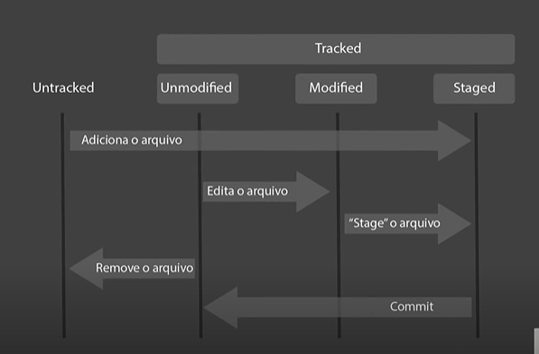

Divisãoj do ambiente de desenvolvimento em um projeto.

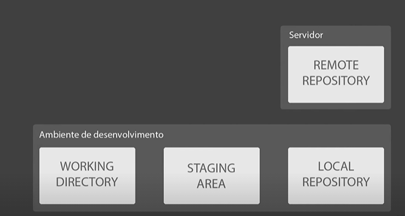

* Comandos
  * git status, monitora os status dos arquivos.
  * git add .
  * 
# **Introdução ao Github**

# **Resolvendo conflitos**
Conflito de merge:

Imagem ilustrativa

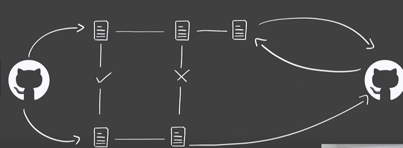

Neste caso o repositório, foi atuazizado. Logo, temos que atualizar o repositório local com as atualizações do git remoto.

Abre o arquivo, faz a verificação de qual arquivo tem que se manter. Após isso, basta fazer os comandos de atualização padrão.

